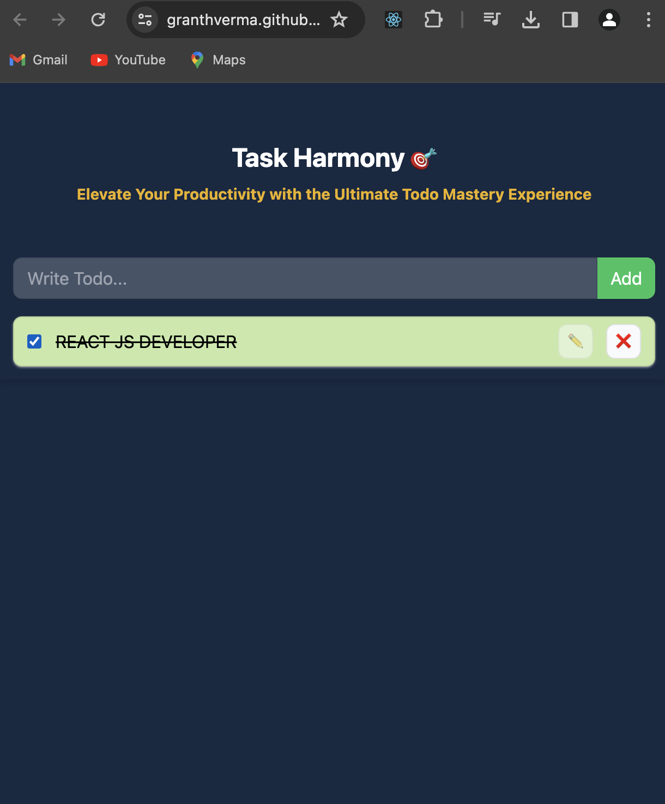
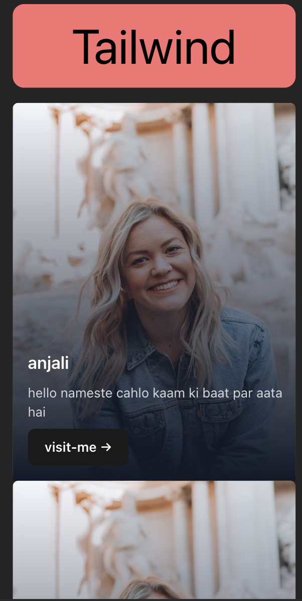
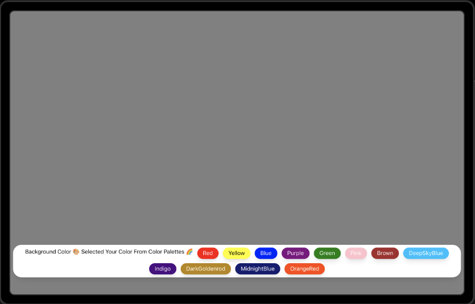

## My Journey as a React.js Developer: Showcasing My Talents @GRANTHCODES

Greetings, fellow developers and tech enthusiasts! I am excited to share my journey as a React.js developer, taking you through the exciting projects I've worked on during my time at GRANTHCODES. Strap in for a ride into the world of React.js, where each project reflects my passion for crafting dynamic and user-friendly web applications.
### Demo :

### You can Check it Live on Below Link :

[Live Link !](https://reactcounter-sigma.vercel.app/)

Certainly! Below is a sample article for showcasing your React.js projects and expressing your journey as a React.js developer on GRANTHCODES:

---

## The Journey Begins

As I embarked on my React.js journey, I set out to create projects that not only demonstrated my technical skills but also showcased my creativity and commitment to delivering high-quality applications. The following projects encapsulate the essence of my journey:

### 1. **Todo-AppContextApi**

The Todo-AppContextApi is more than just a task manager; it's a testament to my mastery of React, utilizing the powerful Context API for state management. The project is built with modern web development practices, including Vite for efficient bundling and deployment. Explore the live demo [here](https://granthverma.github.io/TodoAppContextApi/) and the source code on [GitHub](https://github.com/granthverma/TodoAppContextApi/tree/main).

### 2. **The React Counter**

The React Counter project isn't just about counting numbers; it's a showcase of React state management using `useState`. With Vite for fast development and Vercel for deployment, this project highlights the seamless integration of React with other tools. Experience the live demo [here](https://reactcounter-sigma.vercel.app/) and explore the code on [GitHub](https://github.com/granthverma/reactcounter).

### 3. **The Tailwind Props Project**

The Tailwind Props Project dives into the world of styling with Tailwind CSS. Leveraging Vite for rapid development and Vercel for deployment, this project beautifully demonstrates the use of props in React components. Take a look at the live demo [here](https://tailwindprops.vercel.app/) and find the source code on [GitHub](https://github.com/granthverma/tailwindprops).

### 4. **Background Changer**

The Background Changer project is a visual delight, showcasing my skills in React and Tailwind CSS. Witness the dynamic change of background colors with React state management. Check out the live demo [here](https://bg-changer-theta.vercel.app/) and explore the code on [GitHub](https://github.com/granthverma/bgChanger).

### 5. **React Password Generator**

The React Password Generator project is a robust application that highlights my expertise in React hooks. With options to customize password length and content, this project also emphasizes efficient deployment using Vercel. Generate your secure password with the live demo [here](https://react-passwordgenerator.vercel.app/) and find the source code on [GitHub](https://github.com/granthverma/reactPasswordgenerator).

### 6. **Context API**

The Context API project showcases simplified user authentication using React's Context API. With a user-friendly authentication flow and deployment on Vercel, this project emphasizes the power of context-based state management. Explore the live demo [here](https://context-api-zeta.vercel.app/) and dive into the code on [GitHub](https://github.com/granthverma/Context-Api).

### 7. **Theme-switcher**

The Theme-switcher project introduces users to the flexibility of visual themes, such as light and dark modes. Leveraging Tailwind CSS and JavaScript, this project dynamically adjusts the interface styling based on the selected theme. Switch between themes in the live demo [here](https://theme-switcher-pi.vercel.app/) and explore the source code on [GitHub](https://github.com/granthverma/Theme-Switcher).

## Connecting with the Developer: @GRANTHCODES

Connect with me on LinkedIn: [Himanshu Verma](https://www.linkedin.com/in/granthcodes/) and explore my GitHub repositories: [GRANTHCODES GitHub](https://github.com/granthverma). Your feedback and collaboration are always welcome!

I hope you enjoy exploring these projects as much as I enjoyed creating them. Stay tuned for more exciting developments on my journey as a React.js developer. Happy coding! 🚀

---

